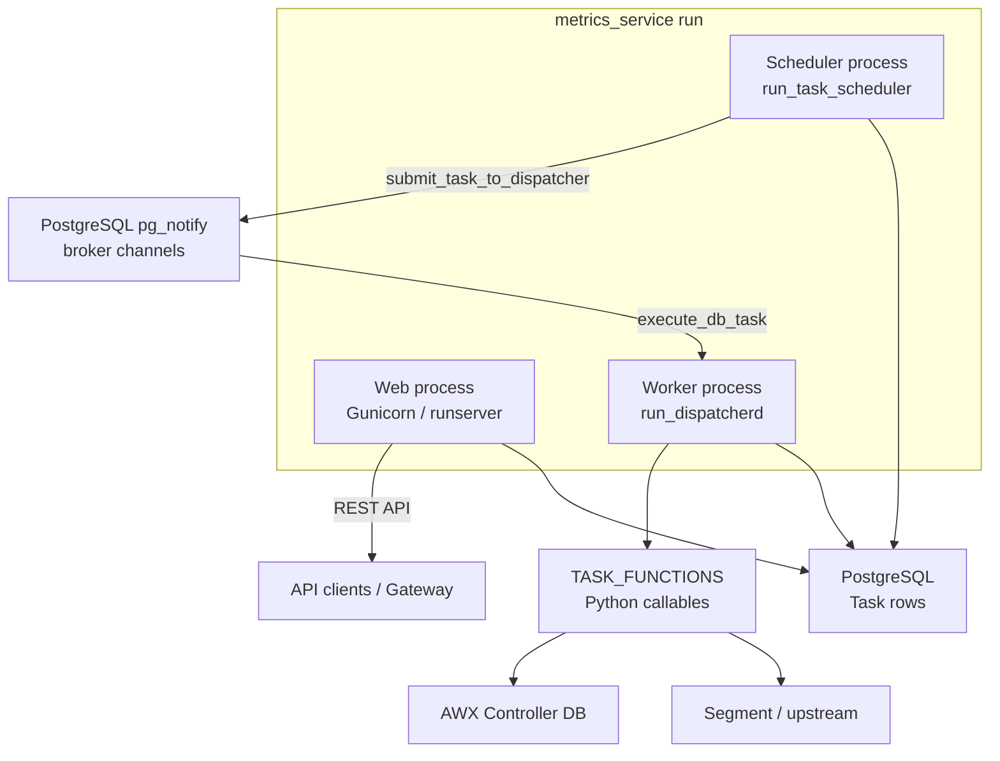

# Metrics Service Architecture

This directory contains architecture documentation for the metrics-service
application. Each document covers a specific domain with diagrams and links to
source code.

## Runtime Overview

The service runs as three cooperating processes when started via
`python manage.py metrics_service run` (or `tools/dev.sh` in development):



| Process | Management command | Role |
|---------|-------------------|------|
| Web | `runserver` / Gunicorn | REST API, DAB RBAC endpoints, OpenAPI docs |
| Workers | `run_dispatcherd` | Executes task functions via `execute_db_task` |
| Scheduler | `run_task_scheduler` | APScheduler reconciliation, submits work to dispatcherd |

The scheduler **does not execute task code** — it discovers `Task` rows in the
database and submits them to dispatcherd workers. See
[apscheduler.md](apscheduler.md) and [task-system.md](task-system.md).

In Kubernetes/OpenShift deployments these processes can run as separate pods.
The scheduler must be running for recurring and immediate tasks to be picked up;
workers must be running for submitted tasks to execute.

## Application Map

| App | Path | Responsibility |
|-----|------|----------------|
| `core` | `apps/core/` | User/Organization/Team models, DAB integration, JWT auth, RBAC |
| `tasks` | `apps/tasks/` | Background task system, collectors, scheduling, execution |
| `dynamic_settings` | `apps/dynamic_settings/` | DB-backed runtime settings (including feature enablement values) |
| `dashboard_reports` | `apps/dashboard_reports/` | Job data store for automation-reports API |
| `settings` | `apps/settings/` | Dynaconf defaults and mode-specific overrides |

URL loading order (see `metrics_service/urls.py`):

1. Django-Ansible-Base URLs (RBAC, resource registry, activity stream)
2. Dynamic API root views
3. Cross-app URLs (`apps/urls.py`)
4. Per-app URLs (`apps/core/urls.py`, `apps/tasks/urls.py`, etc.)

## Settings and Feature Enablement

Settings merge via Dynaconf (later layers override earlier):

1. `metrics_service/settings.py` — framework defaults
2. `apps/settings/defaults.py` — project defaults
3. `apps/core/settings.py` — DAB configuration
4. `apps/*/settings.py` — per-app settings
5. `apps/settings/{mode}.py` — dev/prod/test
6. `settings.local.py` — local overrides (git-ignored)
7. `/etc/ansible-automation-platform/metrics_service/settings.yaml` — production
8. `METRICS_SERVICE_*` environment variables

**Feature enablement settings** gate **task groups** at runtime. These are
distinct from **platform feature flags** (DAB `AAPFlag` / `/api/v1/feature_flags_state/`
and Controller `feature_flags_service` collector data). Enablement settings
control whether scheduled task groups run; they are stored under
`task_data["_feature_flag"]` on system tasks and checked by the scheduler and
workers without requiring a restart (when toggled via DB/API). Env var changes
require a pod restart.

| Enablement setting | Default | Task group |
|--------------------|---------|------------|
| `METRICS_COLLECTION` | `true` | Hourly/daily collectors, rollup, metrics cleanup |
| `ANONYMIZED_DATA_COLLECTION` | `true` | Anonymization and Segment transmission |
| `DASHBOARD_COLLECTION` | `true` | Dashboard backfill and cleanup |
| `INDIRECT_NODE_COLLECTION` | `true` | Indirect managed node daily collector |

Details: [dynamic-settings.md](dynamic-settings.md).

System tasks are defined in `apps/tasks/task_groups.py` and synced to the
database with:

```bash
python manage.py metrics_service init-system-tasks
```

## External Components

| Component | Role | Documentation |
|-----------|------|---------------|
| [dispatcherd](https://github.com/ansible/dispatcherd) | Task worker broker (`pg_notify`); runs `execute_db_task` in subprocesses | [task-system.md](task-system.md), [dispatcherd config](https://github.com/ansible/dispatcherd/blob/main/docs/config.md) |
| [metrics-utility](https://github.com/ansible/metrics-utility) | Collector SQL, rollups, anonymization, Segment client | [collectors.md](collectors.md) |
| [django-ansible-base](https://github.com/ansible/django-ansible-base) | RBAC, JWT, resource registry | [core-rbac.md](core-rbac.md) |

## Documentation Index

| Document | Description |
|----------|-------------|
| [core-rbac.md](core-rbac.md) | DAB integration, JWT authentication, RBAC roles, gateway resource sync |
| [task-system.md](task-system.md) | End-to-end task architecture: models, task groups, dispatcherd, queues, API |
| [task-state-machine.md](task-state-machine.md) | Task states, retries, crash recovery, periodic sync (deep dive) |
| [apscheduler.md](apscheduler.md) | `UnifiedTaskScheduler`, triggers, `_db_task_jobs`, AWX DB gate |
| [dynamic-settings.md](dynamic-settings.md) | Feature enablement settings, `Setting` model, resolution order |
| [collectors.md](collectors.md) | Metrics collectors, schedules, rollup pipeline |
| [anonymization-and-transmission.md](anonymization-and-transmission.md) | Anonymization, Segment transmission, opt-out |
| [dashboard-sync.md](dashboard-sync.md) | Dashboard data collection: backfill and hourly hooks |
| [dashboard-reports-api.md](dashboard-reports-api.md) | Automation-reports REST API for dashboard UI |
| [data-models.md](data-models.md) | Entity relationships across tasks, metrics, and dashboard models |

## Where to Start

**Operators** — Start with this page, then [task-system.md](task-system.md) for
CLI commands and [dynamic-settings.md](dynamic-settings.md) for enablement
toggles. Dashboard: [dashboard-sync.md](dashboard-sync.md) (collection) and
[dashboard-reports-api.md](dashboard-reports-api.md) (API status endpoints).

**Developers adding a background task** — [task-system.md](task-system.md)
(overview) → implement in `collectors/`, `cleanup/`, or `simple/` (or
`dashboard_reports/tasks.py` for dashboard sync) → run `init-system-tasks`.

**Developers adding RBAC-protected APIs** — [core-rbac.md](core-rbac.md).

**Debugging stuck or failed tasks** — [task-state-machine.md](task-state-machine.md).

**Upstream transmission / opt-out** — [anonymization-and-transmission.md](anonymization-and-transmission.md).

**API consumers** — [dashboard-reports-api.md](dashboard-reports-api.md) and
OpenAPI at `/api/docs/`; auth in [core-rbac.md](core-rbac.md).

**Data model reference** — [data-models.md](data-models.md).
