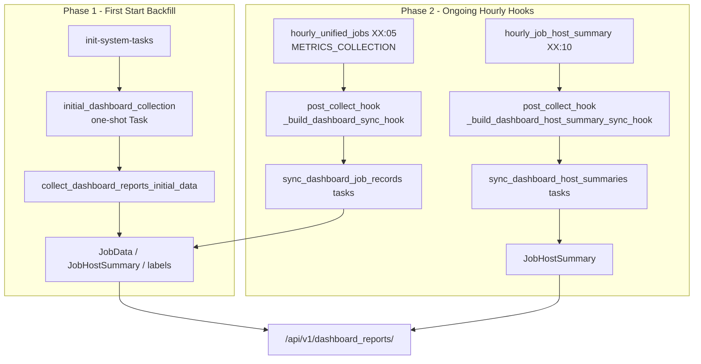
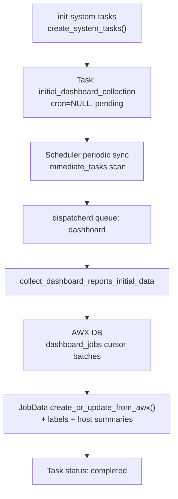
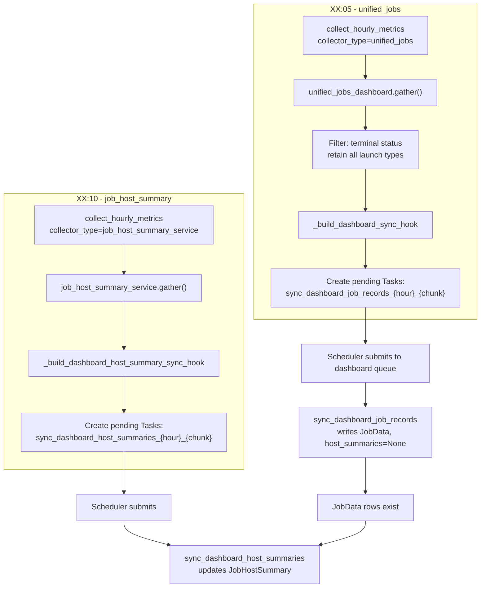

# Automation Dashboard Sync

The dashboard sync pipeline populates `apps/dashboard_reports` with AWX job
data for the automation-reports REST API (`/api/v1/dashboard_reports/`). It is
**separate from the anonymization pipeline** — both may query similar AWX data,
but dashboard data is stored in `JobData` / `JobHostSummary` for local API
consumers, not sent to Segment.

See [collectors.md](collectors.md) for the metrics rollup path that runs in
parallel on the same hourly collectors.

## Overview



| Phase | Mechanism | When |
|-------|-----------|------|
| Backfill | One-shot system task | First enable / fresh install |
| Ongoing | Post-collect hooks on hourly metrics collectors | Every hour after backfill |

There is **no scheduled cron** for ongoing incremental dashboard collection.
`collect_dashboard_reports_data` is **deprecated** (manual/API invocation only).

## Feature Enablement Setting

Controlled by the `DASHBOARD_COLLECTION` feature enablement setting (default:
`true`). This is not a platform feature flag (DAB `AAPFlag` / Controller
`feature_flags_service` data).

- Task group: `DASHBOARD_COLLECTION_GROUP` in `task_groups.py`
- Disable: `METRICS_SERVICE_FEATURE__DASHBOARD_COLLECTION=false` or
  dynamic settings API / DB row
- Runtime check: scheduler and hooks use `get_feature_enabled_from_db()`

**Enablement interaction:**

| Mode | `METRICS_COLLECTION` | `DASHBOARD_COLLECTION` | Effect |
|------|----------------------|------------------------|--------|
| Rollups only | on | off | Hourly collectors run; no dashboard hooks |
| Backfill / manual sync | off | on | `initial_dashboard_collection` and API-triggered sync tasks can run |
| Ongoing incremental sync | on | on | Hourly collectors fire dashboard hooks (required path) |

Ongoing incremental sync is **not** independent of metrics collection: hooks are
registered in `collect_hourly_metrics.py` and only run when hourly collectors
execute. Pausing `METRICS_COLLECTION` stops ongoing dashboard updates even if
`DASHBOARD_COLLECTION` remains enabled. First-start backfill and manual sync
tasks can still run with only `DASHBOARD_COLLECTION` enabled.

## Phase 1: First-Start Backfill



### Registration

`initial_dashboard_collection` in `DASHBOARD_COLLECTION_GROUP`:

- `function`: `collect_dashboard_reports_initial_data`
- `cron`: `None` (immediate one-shot)
- Queue: `dashboard`

### Does not re-run on upgrade

`create_system_tasks()` snapshots completed one-shot system tasks before
deleting and recreating system task rows. If `initial_dashboard_collection`
already completed, its `completed` status is restored so the backfill does not
repeat on upgrade.

### Backfill logic

Implemented in `apps/dashboard_reports/tasks.py`:

1. **Date window** — `since` defaults to `JobData.last_finished_timestamp()` or
   a retention window (default 90 days, or Controller `cleanup_jobs` schedule
   when `DASHBOARD_COLLECTION.USE_CONTROLLER_RETENTION` is enabled).
2. **Query** — `metrics_utility.library.collectors.dashboard.dashboard_jobs`
   against the AWX database. All terminal job types, including `sync` and
   `workflow`, are retained in `JobData`; report filtering is applied when the
   dashboard API reads the data.
3. **Pagination** — cursor batches (`BACKFILL_BATCH_SIZE`, default 5000).
4. **Write** — `JobData.create_or_update_from_awx()` with labels and host summaries.
5. **Telemetry** — `DashboardTelemetry` row per run.

### Collection status API

`apps/dashboard_reports/viewsets/collection_status.py` exposes:

- `initial_collection_status`
- `min_collection_timestamp`
- `next_run`

## Phase 2: Ongoing Sync via Hooks

Incremental sync piggybacks on **metrics hourly collectors** via
`post_collect_hook` in `generic_collect_metrics()`. No extra AWX queries for
job records — raw DataFrames from the collector are serialized into follow-up
tasks.



### Ordering constraint

`hourly_unified_jobs` (XX:05) **must run before**
`hourly_job_host_summary` (XX:10).

The unified_jobs hook dispatches `sync_dashboard_job_records`, which creates
`JobData` rows. The host summary hook dispatches `sync_dashboard_host_summaries`,
which looks up jobs by `job_id`. If host summaries run first, matching
`JobData` rows do not exist and records are silently skipped with no retry.

The XX:05 → XX:10 schedule is an **operational ordering assumption**, not a
completion guarantee. Large job batches spawn multiple async
`sync_dashboard_job_records` tasks (500 jobs per chunk); host summaries may run
before all chunks finish. Skipped host summaries are not automatically retried.
Monitor pending dashboard sync tasks and `JobHostSummary` coverage when
collections are large or workers are slow.

### Hook details

| Hook | Source collector | Follow-up task | Writes |
|------|------------------|----------------|--------|
| `_build_dashboard_sync_hook` | `unified_jobs` | `sync_dashboard_job_records` | `JobData` (no host summaries) |
| `_build_dashboard_host_summary_sync_hook` | `job_host_summary_service` | `sync_dashboard_host_summaries` | `JobHostSummary` |

- Chunk size: 500 job records per task
- Tasks carry `_feature_flag: DASHBOARD_COLLECTION`
- Stale pending chunks from prior runs are deleted when chunk count shrinks

### Deprecated incremental task

`collect_dashboard_reports_data` performed scheduled incremental sync from
the last known timestamp. Ongoing sync now uses hooks. The function remains in
`TASK_FUNCTIONS` for manual/API invocation only — it is **not** in `task_groups.py`.

`DASHBOARD_COLLECTION.COLLECTION_SCHEDULE_CRON` in `apps/settings/defaults.py`
(`"0 */6 * * *"`) is unused legacy configuration from the pre-hook design.

## Cleanup Tasks

| Task | Cron | Function |
|------|------|----------|
| `cleanup_dashboard_reports_old_data` | `30 5 * * *` | Delete `JobData` beyond retention |
| `cleanup_dashboard_telemetry` | `45 5 * * *` | Delete `DashboardTelemetry` older than 60 days |

Retention for job data defaults to Controller `cleanup_jobs` schedule when
`USE_CONTROLLER_RETENTION` is enabled.

## Configuration

`DASHBOARD_COLLECTION` dict in `apps/settings/defaults.py`:

| Key | Purpose |
|-----|---------|
| `BACKFILL_BATCH_SIZE` | Cursor batch size for initial backfill (default 5000) |
| `USE_CONTROLLER_RETENTION` | Use AWX cleanup_jobs schedule for retention window |

## Separation from Anonymization

| Aspect | Dashboard sync | Metrics / anonymization |
|--------|----------------|-------------------------|
| Destination | `JobData`, `JobHostSummary` | `HourlyMetricsCollection` → Segment |
| API consumer | `/api/v1/dashboard_reports/` | Red Hat upstream |
| Ongoing mechanism | Post-collect hooks | Scheduled collectors + rollup |
| Feature enablement setting | `DASHBOARD_COLLECTION` | `METRICS_COLLECTION`, `ANONYMIZED_DATA_COLLECTION` |

Hourly collectors run both paths when flags are enabled: rollup to metrics DB
and hook-created sync tasks to dashboard tables.

## Sync/workflow job visibility

Dashboard ingestion always stores terminal jobs, including jobs whose
`launch_type` is `sync` or `workflow`. The dashboard API excludes those two
launch types by default to preserve the existing report behavior.

Operators can change the global runtime setting through
`PATCH /api/v1/settings/dashboard/` (gateway path:
`/api/metrics/v1/settings/dashboard/`):

```json
{"include_sync_workflow_jobs": true}
```

The setting is `false` when absent. Disabling it later hides those rows from
dashboard reports but does not delete the retained data. The daily
`reconcile_dashboard_data` task and the manual `sync_dashboard_jobs_manual`
task use the same all-terminal-job collection path and are safe to rerun.

## Related Documentation

- [collectors.md](collectors.md) — hourly collector schedules and rollup pipeline
- [dashboard-reports-api.md](dashboard-reports-api.md) — REST API consuming synced data
- [apscheduler.md](apscheduler.md) — how hook-created immediate tasks are submitted
