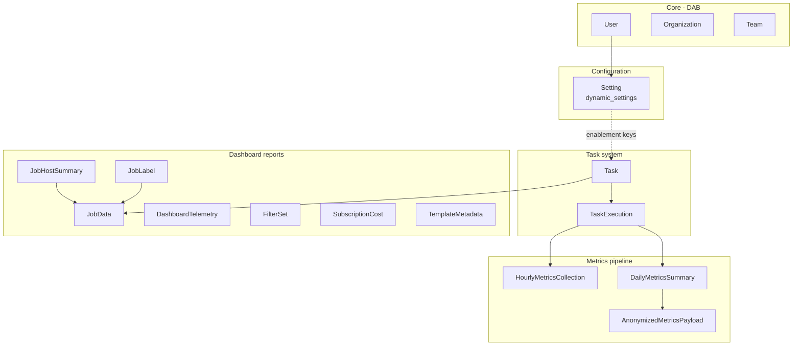

# Data Models

Entity-relationship overview for metrics-service persistence. Task execution
lifecycle detail remains in [task-state-machine.md](task-state-machine.md).

## High-Level Domains

## Task System (`apps/tasks/models.py`)

### Task

Scheduler queue and execution state for all background work.

| Field group | Key fields |
|-------------|------------|
| Identity | `name`, `function_name`, `task_data` (JSON) |
| Schedule | `scheduled_time`, `cron_expression`, `is_system_task` |
| Execution | `status`, `attempts`, `max_attempts`, `result_data`, `error_message` |
| Ownership | `created_by` → `core.User` |

Query helpers: `immediate_tasks()`, `scheduled_tasks()`, `recurring_tasks()`,
`ready_to_run()`.

### TaskExecution

One immutable row per execution attempt.

| Field | Purpose |
|-------|---------|
| `task` | FK to `Task` |
| `status`, `started_at`, `completed_at` | Attempt outcome and timing |
| `result_data`, `error_message` | Per-attempt results |
| `worker_id` | Dispatcher worker identifier |
| `execution_time_seconds` | Auto-calculated on save |

## Metrics Pipeline (`apps/tasks/models.py`)

### HourlyMetricsCollection

Per-collector rollup storage (hourly, daily snapshot, and daily time-range
collectors all persist here).

| Field | Purpose |
|-------|---------|
| `collector_type` | e.g. `unified_jobs`, `execution_environments` |
| `collection_timestamp` | Hour bucket (snapshots use previous-day 23:00 trick) |
| `raw_data` | Rollup JSON (not raw AWX rows at scale) |
| `status` | `collected`, `processed`, `failed`, etc. |
| `task_execution` | FK to creating `TaskExecution` |

Unique: `(collector_type, collection_timestamp)`.

### DailyMetricsSummary

Merged daily rollup across all collectors for one calendar day.

| Field | Purpose |
|-------|---------|
| `summary_date` | Unique calendar date |
| `aggregated_metrics` | Merged rollup JSON by collector key |
| `hourly_collection_ids` | Map collector → list of `HourlyMetricsCollection` IDs |
| `config_data` | Daily `config` collector snapshot |
| `status` | `pending` → `aggregated` → `anonymized` → `sent` |
| `rollup_task_execution` | FK to `daily_metrics_rollup` execution |

### AnonymizedMetricsPayload

Prepared Segment payload before/after transmission.

| Field | Purpose |
|-------|---------|
| `summary_date` | Covered date |
| `anonymized_data` | Flattened anonymized JSON |
| `status` | `pending`, `sending`, `sent`, `retry`, `failed`, `unavailable` |
| `daily_summary` | FK to `DailyMetricsSummary` |
| `segment_event_name`, `segment_user_id` | Segment routing |
| `retry_count`, `max_retries` | Payload-level send retries |
| `sent_at` | Successful transmission time |

Constraint: one active payload per summary (`unique_active_payload_per_summary`).

Pipeline detail: [anonymization-and-transmission.md](anonymization-and-transmission.md).

## Dashboard Reports (`apps/dashboard_reports/models.py`)

Local store for automation-reports UI — **not** sent to Segment as raw job rows.

### JobData

AWX job execution record for reporting.

| Field group | Examples |
|-------------|----------|
| AWX identity | `job_id` (unique), `template_id`, `project_id`, `organization_id` |
| Timing | `started`, `finished`, `elapsed` |
| Status | `status` (`successful`, `failed`, …) |
| Launch type | `launch_type` (`manual`, `scheduled`, `sync`, `workflow`, …) |
| Hosts | `num_hosts` |
| Launcher | `launched_by_id`, `launched_by_username` |

Populated by [dashboard-sync.md](dashboard-sync.md). API: [dashboard-reports-api.md](dashboard-reports-api.md).

### JobHostSummary

Per-host outcome for a job. FK logical link via `job_id` to `JobData.job_id`.

### JobLabel

Many-to-many labels on jobs (`job_id` + label id/name).

### DashboardTelemetry

Per-run collection stats (batch sizes, duration) — operator telemetry and
anonymized rollup metadata, not raw jobs.

### FilterSet

Saved UI filter configurations (user-owned).

### SubscriptionCost

Singleton ROI settings (`pk=1`): monthly subscription cost, engineer hourly rate.

### TemplateMetadata

Estimated run duration per AWX job template for cost calculations.

## Dynamic Settings (`apps/dynamic_settings/models.py`)

### Setting

Runtime configuration audit log and feature enablement storage.

| Field | Purpose |
|-------|---------|
| `setting_key` | Unique key (`METRICS_COLLECTION`, etc.) |
| `current_value` / `previous_value` | JSON-serialized values |
| `last_modified_by` | FK to `core.User` |

See [dynamic-settings.md](dynamic-settings.md).

## Core (`apps/core/models/`)

Thin DAB consumer models — synced from gateway, not metrics-specific:

| Model | Notes |
|-------|-------|
| `User` | `AUTH_USER_MODEL`; `is_platform_auditor` |
| `Organization` | Gateway-synced; no local POST |
| `Team` | FK to `Organization` |

See [core-rbac.md](core-rbac.md).

## Database Connections

| Django alias | Typical use |
|--------------|-------------|
| `default` | metrics-service PostgreSQL — all models above |
| `awx` | Live AWX Controller reads in collectors and some filter endpoints |

Collectors and dashboard backfill query `awx`; `task_executions_service` uses
`default` for pipeline observability.

## Related Documentation

- [task-system.md](task-system.md) — how `Task` rows are scheduled and executed
- [collectors.md](collectors.md) — what gets written to `HourlyMetricsCollection`
- [dashboard-sync.md](dashboard-sync.md) — `JobData` population
- [anonymization-and-transmission.md](anonymization-and-transmission.md) — payload lifecycle
