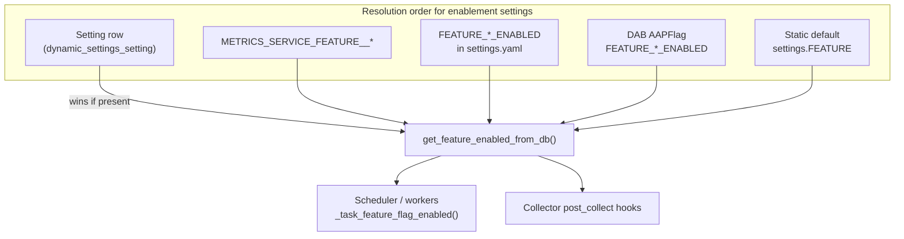

# Dynamic Settings and Feature Enablement

The `apps/dynamic_settings` app stores runtime configuration in PostgreSQL and
powers **feature enablement settings** — the toggles that gate scheduled task
groups (`METRICS_COLLECTION`, `DASHBOARD_COLLECTION`, etc.).

This is **not** the same as **platform feature flags** (DAB `AAPFlag` rows,
`/api/v1/feature_flags_state/`, or Controller `feature_flags_service` collector
data). See [collectors.md](collectors.md) for platform flag snapshots in the
metrics rollup pipeline.

## Overview



| Concept | What it controls | Where stored |
|---------|------------------|--------------|
| Feature enablement setting | Whether a **task group** runs | `Setting.setting_key` = `METRICS_COLLECTION`, etc. |
| Platform feature flag | Controller/AAP platform flag **state** (metrics data) | AWX DB → `feature_flags_service` collector |
| DAB `AAPFlag` | Platform installer defaults for AAP features | `ansible_base_feature_flags` tables |

## Setting Model

`apps/dynamic_settings/models.py` — `Setting`:

| Field | Purpose |
|-------|---------|
| `setting_key` | Unique key (e.g. `METRICS_COLLECTION`) |
| `current_value` | JSON-serialized value |
| `previous_value` | Previous value for rollback |
| `last_modified_by` | User who made the change (nullable for system) |

Sensitive keys (`SECRET_KEY`, `PASSWORD`, `DATABASES`, etc.) are redacted as
`***REDACTED***` when logged via `log_setting_change()`.

Supported dashboard settings are available through the runtime REST API at
`/api/v1/settings/dashboard/` (gateway path:
`/api/metrics/v1/settings/dashboard/`). Other settings remain managed via:

- Environment variables (`METRICS_SERVICE_FEATURE__*`)
- Django admin (`SettingAdmin`)
- Direct DB updates (`dbshell`, automation)
- `rollback_configuration_change()` for audited rollbacks

`DASHBOARD_INCLUDE_SYNC_WORKFLOW_JOBS` defaults to `false`. Platform auditors
can read it; system administrators can update it with a JSON boolean:

```json
{"include_sync_workflow_jobs": true}
```

## Feature Enablement Settings

Defined in `apps/settings/defaults.py` under `FEATURE` and referenced in
`apps/tasks/task_groups.py`:

| Setting key | Default | Task group |
|-------------|---------|------------|
| `METRICS_COLLECTION` | `true` | Hourly/daily collectors, rollup, metrics cleanup |
| `ANONYMIZED_DATA_COLLECTION` | `true` | `daily_anonymize_and_prepare` |
| `DASHBOARD_COLLECTION` | `true` | Dashboard backfill and cleanup |
| `INDIRECT_NODE_COLLECTION` | `false` | Indirect managed node collector (opt-in) |

### Resolution order

`get_feature_enabled_from_db()` in `task_groups.py`:

1. **`Setting` DB row** — if `setting_key` exists and `current_value` parses as boolean
2. **`settings.FEATURE[key]`** — includes `METRICS_SERVICE_FEATURE__*` env merges via Dynaconf
3. **Top-level `FEATURE_<name>_ENABLED`** — installer `settings.yaml` attribute
4. **DAB `AAPFlag`** — `FEATURE_<name>_ENABLED` boolean flag
5. **Function `default` argument**

A `false` DB row is an **explicit opt-out** that survives upgrades. A `true` DB
row is **not** always redundant: when env or installer settings resolve to
`false`, a `true` DB row is an intentional override. `init-default-settings`
only removes `true` rows that are redundant with defaults (no conflicting
`false` from env/installer).

### Runtime gating

System tasks store the enablement key in `task_data["_feature_flag"]` (legacy
field name). The scheduler and workers call `get_feature_enabled_from_db()` at
execution time — toggling a `Setting` row or using the dynamic settings path
takes effect **without redeploying** task definitions.

Env var changes require a **pod restart** to reload Dynaconf.

```bash
# Pause metrics collection (requires restart)
METRICS_SERVICE_FEATURE__METRICS_COLLECTION=false

# Opt out of upstream transmission (requires restart)
METRICS_SERVICE_FEATURE__ANONYMIZED_DATA_COLLECTION=false
```

## Management Commands

Via `python manage.py metrics_service`:

| Command | Behavior |
|---------|----------|
| `init-default-settings` | Removes redundant `true` rows for `FEATURE` keys so env vars apply |
| `remove-default-settings --all-settings` | Deletes all `Setting` rows |

Standalone:

```bash
python manage.py dynamic_settings reload_config
```

## Rollback

`rollback_configuration_change(change_id, user)` in `apps/dynamic_settings/utils.py`:

1. Loads the `Setting` row by ID
2. Applies `previous_value` via `DYNACONF.set()`
3. Logs a new `Setting` row for the rollback action

Cannot rollback redacted sensitive settings.

## init-default-settings behavior

`initialize_default_settings()` does **not** seed feature enablement values into
the database on fresh install. On upgrade it removes only redundant `true` rows
(where env/installer also resolve to `true`). Explicit `false` opt-outs and
intentional `true` overrides of `false` env values are preserved.

## Related Documentation

- [README.md](README.md) — settings layering and enablement table
- [task-system.md](task-system.md) — how `_feature_flag` gates task groups
- [collectors.md](collectors.md) — per-collector enablement effects
- [dashboard-sync.md](dashboard-sync.md) — `DASHBOARD_COLLECTION` enablement
