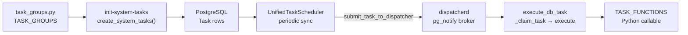
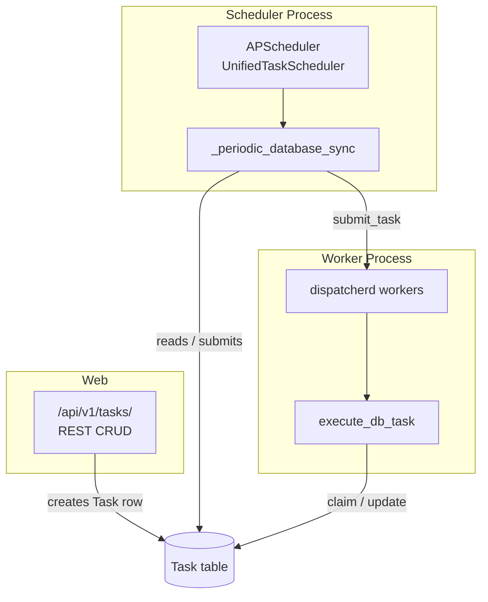
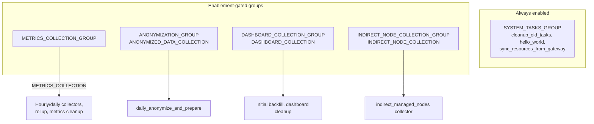

# Task System

The task system provides scheduled and immediate background work for
metrics-service. It combines database-backed `Task` rows, APScheduler for
scheduling reconciliation, and dispatcherd workers for execution.

For task **states, retries, and crash recovery**, see the companion document
[task-state-machine.md](task-state-machine.md). For APScheduler internals, see
[apscheduler.md](apscheduler.md).

## End-to-End Flow



1. **Define** tasks in `apps/tasks/task_groups.py` (`TASK_GROUPS`).
2. **Sync** to the database with `python manage.py metrics_service init-system-tasks`.
3. **Scheduler** discovers pending tasks every ~30 seconds and submits them to dispatcherd.
4. **Workers** claim tasks atomically, run the registered function, and record results.

API-created tasks follow the same path once a `Task` row exists in `pending` status.

## Three-Process Runtime



| Command | Purpose |
|---------|---------|
| `python manage.py metrics_service run` | Starts web + workers + scheduler |
| `python manage.py run_dispatcherd` | Workers only |
| `python manage.py run_task_scheduler` | Scheduler only |
| `python manage.py metrics_service init-system-tasks` | Sync `TASK_GROUPS` → DB |

In container platforms, run scheduler and workers as separate deployments if you
need independent scaling. The web process does not execute background tasks.

## Data Models

Defined in `apps/tasks/models.py`:

| Model | Role |
|-------|------|
| `Task` | Scheduler queue row: status, attempts, `scheduled_time`, `cron_expression`, `task_data` |
| `TaskExecution` | Immutable record of one execution attempt |
| `HourlyMetricsCollection` | Stored rollup data from collectors |
| `DailyMetricsSummary` | Merged daily rollup |
| `AnonymizedMetricsPayload` | Payload prepared for Segment transmission |

### Task shapes

| Type | `scheduled_time` | `cron_expression` | Entry path |
|------|------------------|-------------------|------------|
| Immediate | `NULL` | `NULL` | Periodic sync submits directly |
| Scheduled | set | `NULL` | APScheduler `DateTrigger` |
| Recurring | `NULL` | set | APScheduler `CronTrigger` (template row; spawns child tasks) |

Recurring rows are **templates** — they never run directly. Each cron fire
creates a one-shot child `Task` that flows through the normal state machine.
See [task-state-machine.md §2](task-state-machine.md#2-task-types-and-entry-paths).

## Task Groups and Feature Enablement Settings

`apps/tasks/task_groups.py` is the **source of truth** for system tasks.

**Feature enablement settings** (e.g. `METRICS_COLLECTION`) gate whether task
groups run at runtime. They are not the same as **platform feature flags**
(DAB `AAPFlag` entries or Controller `feature_flags_service` collector data).



| Group | Enablement setting | Default | Key tasks |
|-------|-------------------|---------|-----------|
| `SYSTEM_TASKS_GROUP` | none | always on | `cleanup_old_tasks`, `hello_world`, `sync_resources_from_gateway` |
| `METRICS_COLLECTION_GROUP` | `METRICS_COLLECTION` | `true` | All collectors, `daily_metrics_rollup`, `cleanup_metrics_data` |
| `ANONYMIZATION_GROUP` | `ANONYMIZED_DATA_COLLECTION` | `true` | `daily_anonymize_and_prepare` |
| `DASHBOARD_COLLECTION_GROUP` | `DASHBOARD_COLLECTION` | `true` | `collect_dashboard_reports_initial_data`, dashboard cleanup |
| `INDIRECT_NODE_COLLECTION_GROUP` | `INDIRECT_NODE_COLLECTION` | `true` | `collect_daily_metrics` (indirect nodes) |

`init-system-tasks` registers **all** individually-enabled tasks regardless of
group enablement settings. The `_feature_flag` key in `task_data` stores the
enablement setting name for runtime gating — toggling via DB/API takes effect
without redeploying task definitions.

`create_system_tasks()` preserves `completed` status for one-shot tasks
(`cron_expression=NULL`) across upgrades so tasks like
`initial_dashboard_collection` do not re-run after a successful backfill.

## TASK_FUNCTIONS Registry

`apps/tasks/tasks.py` maps `function_name` strings to Python callables:

| Category | Functions |
|----------|-----------|
| System | `hello_world`, `cleanup_old_tasks`, `sync_resources_from_gateway`, `cleanup_activitystream`, `cleanup_metrics_data` |
| Collectors | `collect_hourly_metrics`, `collect_snapshot_metrics`, `collect_daily_metrics`, `daily_metrics_rollup`, `daily_anonymize_and_prepare`, `send_anonymized_to_segment` |
| Dashboard | `collect_dashboard_reports_initial_data`, `sync_dashboard_job_records`, `sync_dashboard_host_summaries`, cleanup tasks |

`TASK_METADATA` provides queue routing, descriptions, and API documentation.
`TASK_LOCKS` lists functions that acquire PostgreSQL advisory locks during
scheduled execution (see [apscheduler.md](apscheduler.md)).

## Dispatcherd and Queues

Workers use [dispatcherd](https://github.com/ansible/dispatcherd) — a local
background task runner built around PostgreSQL `pg_notify`. metrics-service
configures channels and queue routing; see the
[dispatcherd configuration docs](https://github.com/ansible/dispatcherd/blob/main/docs/config.md)
for broker and worker pool options.

Workers load configuration from `apps/settings/dispatcherd.yaml`. At runtime
`dispatcherd_config.py` injects the Django database connection and sets
`default_timeout` from `TASK_TIMEOUT`.

`submit_task_to_dispatcher()` publishes to dispatcherd:

```python
dispatcherd.publish.submit_task(execute_db_task, queue=queue_name, kwargs={...})
```

Queue routing (`get_queue_for_function`):

| Queue | Typical functions |
|-------|-------------------|
| `metrics` | Collectors, rollup, anonymization, Segment send |
| `dashboard` | Dashboard backfill and sync tasks |
| `maintenance` | Cleanup, hello_world, resource sync |

Broker channels use PostgreSQL `pg_notify`. Multiple worker processes can
consume from the same queue.

### Execution path

All DB tasks enter through a single dispatcherd entry point:

```
execute_db_task → _claim_task (atomic) → execute_claimed → TASK_FUNCTIONS[name]
```

`_claim_task` increments `attempts`, creates a `TaskExecution`, and sets status
to `running`. On success or failure, `update_task_status` writes the result.

## REST API

Task management API: `/api/v1/tasks/` (`apps/tasks/v1/`).

| Endpoint | Action |
|----------|--------|
| `GET /api/v1/tasks/` | List tasks |
| `POST /api/v1/tasks/` | Create task (immediate, scheduled, or recurring) |
| `POST /api/v1/tasks/{id}/retry/` | Retry failed task |
| `POST /api/v1/tasks/{id}/cancel/` | Cancel pending/running task |
| `GET /api/v1/tasks/available_functions/` | List `TASK_FUNCTIONS` with metadata |
| `GET /api/v1/tasks/running/` | List running tasks |

Creating a task via API stores a `Task` row. The scheduler's periodic sync
picks up new immediate, scheduled, and recurring tasks — there is no Django
signals module for auto-submission.

### AWX database gate

During `_periodic_database_sync()`, stuck-task detection and retries run even
when the Controller (AWX) database is unavailable. **New** task scheduling
(`immediate_tasks`, `scheduled_tasks`, `recurring_tasks`) waits until
`awx_db_ready()` returns true — not only collector tasks. API-created immediate
tasks are also deferred until AWX is ready. See [apscheduler.md](apscheduler.md).

## CLI

```bash
# Sync system tasks from task_groups.py
python manage.py metrics_service init-system-tasks

# Retry a failed task
python manage.py metrics_service tasks retry <task_id>

# Force retry (bypass max_attempts)
python manage.py metrics_service tasks retry <task_id> --force
```

## Adding a New Background Task

1. Implement the function in `apps/tasks/collectors/`, `cleanup/`, or
   `simple/` (dashboard sync tasks live in `apps/dashboard_reports/tasks.py`).
2. Register in `TASK_FUNCTIONS` and `TASK_METADATA` in `apps/tasks/tasks.py`.
3. Add a task config entry to the appropriate `TaskGroup` in `task_groups.py`.
4. Run `python manage.py metrics_service init-system-tasks`.
5. Add tests under `tests/unit/tasks/`.

If the task needs a cron schedule, set `cron` in the task group entry. For
one-shot tasks (run once on enable), set `cron: None`.

## Related Documentation

- [task-state-machine.md](task-state-machine.md) — states, retries, backoff, crash recovery
- [apscheduler.md](apscheduler.md) — `UnifiedTaskScheduler` internals
- [collectors.md](collectors.md) — metrics collection pipeline
- [dashboard-sync.md](dashboard-sync.md) — automation-reports data sync
- [core-rbac.md](core-rbac.md) — API authentication and permissions
